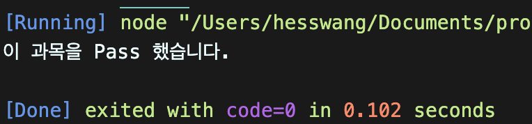
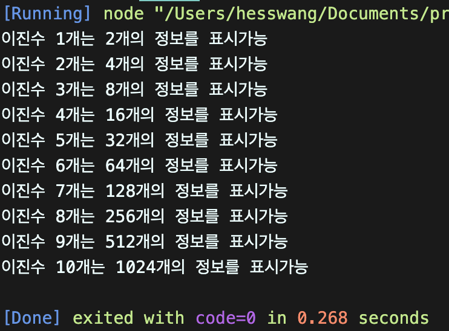
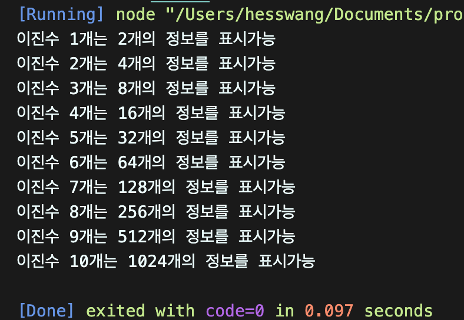

# 왕혜수 연습문제

> 2021-01-26

# 프로그램 흐름제어 연습문제

## 문제1
아래의 `switch문`을 `if문`으로 재작성 하시오.


```javascript
const 수학 = "B";

if (수학 == 'A'||'B'||'C') {
        console.log("이 과목을 Pass 했습니다.");}
else{
        console.log("이 과목을 Pass하지 못했습니다.");

}
```



## 문제2

한 개의 2진수는 `0`과 `1` 두 개의 정보를 표시할 수 있고 두 개의 이진수는 `00`,`01`,`10`,`11`과 같이 총 네 개의 정보를 표시할 수 있다. 이처럼 이진수가 하나 늘어날 때 마다 2배씩 표현할 수 있는 정보의 수가 늘어날 때 10개의 이진수는 총 몇개의 정보를 표현할 수 있는지를 while문으로 구현하시오.

### 출력예시

```javascript
let i = 1;
let x = 1
while (i <= 10){
    
    x*= 2 ;
    console.log("이진수 %d개는 %d개의 정보를 표시가능", i , x );
    i++
};
```



## 문제3

위 2번 문제를 for문으로 다시 표현하시오.
```javascript
let x = 1
for (let i = 1; i <= 10; i++){
    x*= 2 ;
    console.log("이진수 %d개는 %d개의 정보를 표시가능", i , x );
}
```
