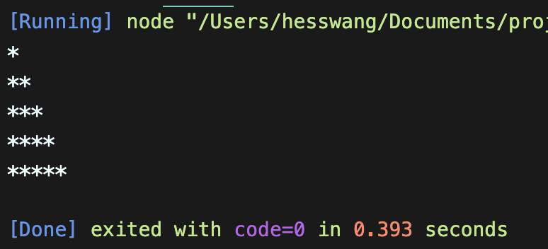
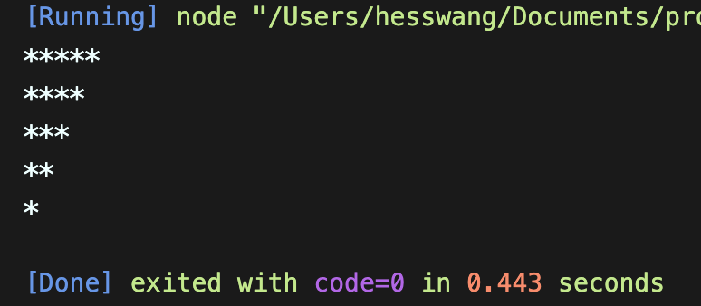

# 왕혜수 연습문제

> 2022-02-07

## 문제1

```javascript
function printStar(max){ 
    for (let i =0; i < max; i++){
        let str = '';
        for (let j = 0; j < i + 1; j++) {
        str += '*';
        }console.log(str);
    }
}
printStar(5);
```




## 문제2


```javascript
function printRevStar(max){
    for (let i =0; i < max; i++){
        let str = '';
        for (let j = 0; j < max - i; j++) {
        str += '*';
        }console.log(str);
    }
}
printRevStar(5);
```




## 문제3


```javascript
//#문제3
function myGame(num){
    for(let i = 0; i < num; i++){
        for(let j= 0; j< i/10)
        if(i[j]%3==0){
        console.log("짝")}
        
    }
}

//#문제3 [풀지 못하여서 ㅜㅜ 첨삭하였습니다]

function myGame(n){
    //박수를 총 몇번 쳤는지에 대한 합계값
    let count = 0;
    for (let i =1; i <=n; i++){
        //현재 숫자(i)를 문자열로 변환함. 33-->"33"
        //--> 문자열은 그자체가 배열이므로 각자리의 숫자를 의미하는
        //글자를 원소로 갖는 배열이 된다고 볼 수있다.
        const str = i + '';
        //console.group(i);
        //출력할 문자열 (숫자인지 박수소리인지...)
        let say = "";
        //이번 턴에 박수를 몇번 치는지 카운트하는 변수
        let clap = 0;
        //숫자를 문자열로 변환하여 각 글자수만큼 반복
        for (let j of str){
            //console.log(j);
            //각 글자가 3,6,9중의 하나라면?
            if (j == "3"||"6"||"9"){
                say+="짝";
                clap++;
            }
        }//console.groupEnd();
        if(clap == 0){
            console.log(i);
        } else {
            console.log(`${say} (${i}) --> ${clap}번`)
            count += clap
        }
        
    }
    console.log();
        console.log(`박수를 총 ${count}번 쳤습니다`);
}

myGame(35);
```

실행결과의 스크린샷