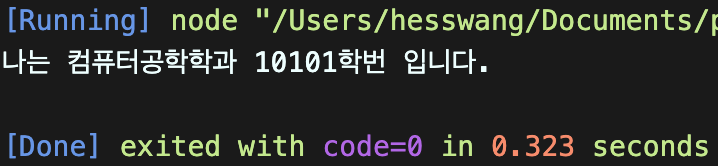

# 왕혜수 class 과제 


> 2022-02-10

## 문제2
다음을 만족하는 Student 클래스를 작성하시오.

1) String형의 학과와 정수형의 학번을 프로퍼티로로 선언후 생성자를 통해 주입
2) getter, setter를 정의
3) sayHello() 메서드를 통해 "나는 OOOO학과 OO학번 입니다." 를 출력하는 기능을 구현
```javascript


class Student {
  constructor(major, balance){
    this._major = major;
    this._number = balance;
  }
  get major(){
    return this._major;
  }
  set major(param){
   this._major = param;
    }
  
  get number(){
    return this._number;
  }
  set number(param){
   this._number = param;
    
  } 
  sayHello(){
    console.log(`나는 ${this.major}학과 ${this.number}학번 입니다.`)
  }
}
const stud1 = new Student();
stud1.major = "컴퓨터공학";
stud1.number = 10101;
stud1.sayHello();
```



## 문제3(뼈대만 잡아놓고 제한시간내 풀지는 못했습니다 ㅠㅠ 
# (뼈대만 잡아놓고 제한시간내 풀지는 못했습니다 ㅠㅠ 답안을 따라 작성해 보았습니다)
다음을 만족하는 클래스 Account를 작성하시오.

1) 다음의 2 개의 필드를 선언
    문자열 owner; (이름)
    숫자형 balance; (금액)
2) 위 모든 필드에 대한 getter와 setter의 구현
3) 위 모든 필드를 사용하는 가능한 모든 생성자의 구현
3) 메소드 deposit()의 헤드는 다음과 같으며 인자인 금액을 저축하는 메소드
    deposit(amount)
4) 메소드 withdraw()의 헤드는 다음과 같으며 인자인 금액을 인출(리턴)하는 메소드
    withdraw(long amount)
    인출 상한 금액은 잔액까지로 하며, 이 경우 이러한 상황을 출력

```javascript
class Account {
  constructor(owner, balance){
    this._owner = owner;
    this._balance = balance;
  }
  get owner(){
    return this._owner;
  }
  set owner(param){
    this._owner = param;
  }
  get balance(){
    return this._balance;
  }
  set balance(param){
    this._balance = param;
  }
  deposit(amount){
    this.balance += amount;
    return amount;
  };
  withdraw(amount){
    if(this.balance < amount){
      console.log("잔액이 부족합니다");
      console.log(`잔액은${this.balance}입니다`);
    }
    this.balance -= amount;
    return amount;
  };
}

const acc = new Account("Hello", 15000);
console.log("%s 의 잔액은 %d원", acc.owner, acc.balance);

acc.deposit(5000);
console.log("%s 의 잔액은 %d원", acc.owner, acc.balance);

acc.withdraw(15000);
console.log("%s 의 잔액은 %d원", acc.owner, acc.balance);

acc.deposit(5000);
console.log("%s 의 잔액은 %d원", acc.owner, acc.balance);

acc.withdraw(15000);
console.log("%s 의 잔액은 %d원", acc.owner, acc.balance);
//잔액이 부족합니다 Hello의 잔약은 10000원
```