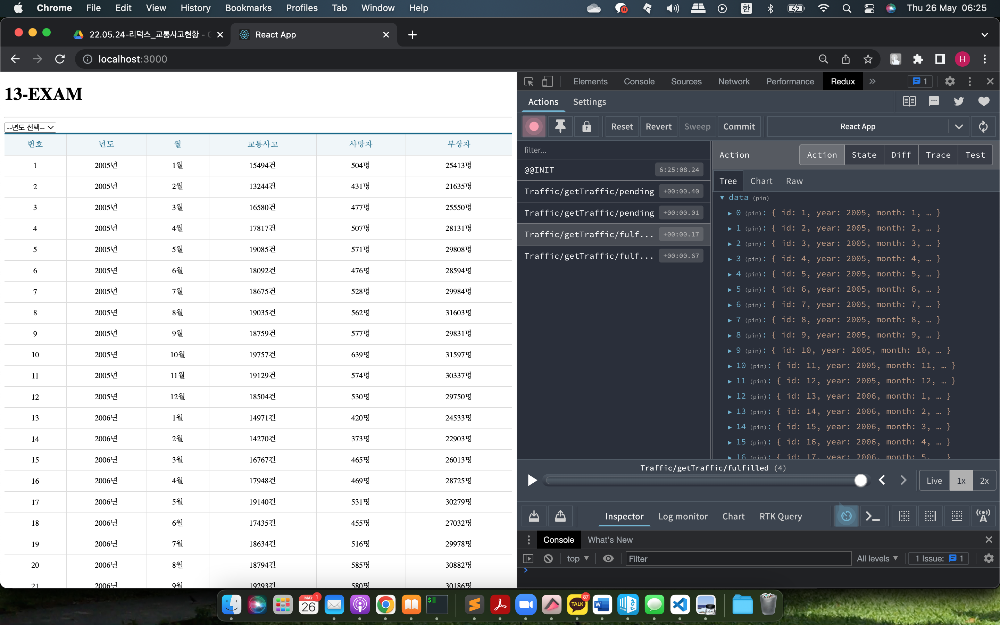
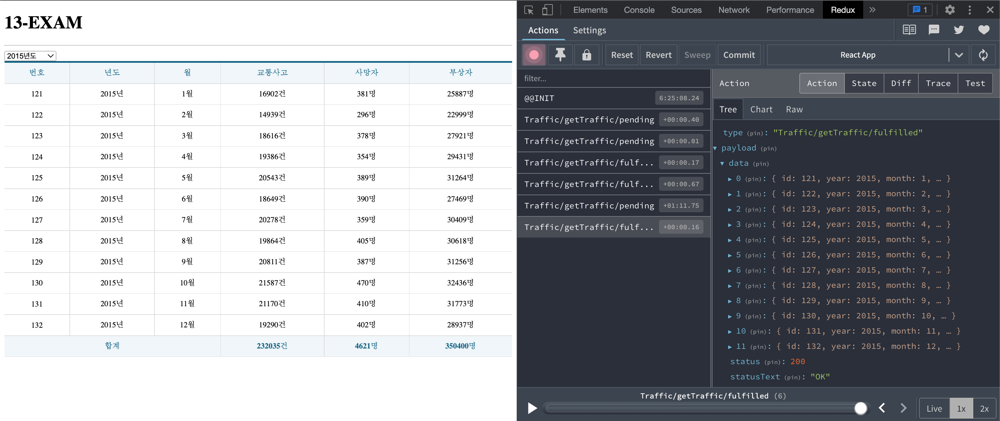
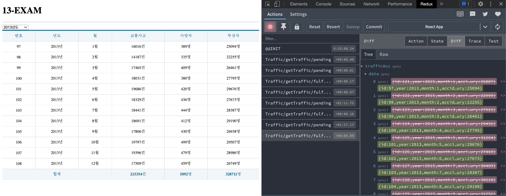

# 연습문제 13




-----
>예제와 동일한 코드는 생략하였습니다
-----
src/slices/TrafficSlice.js
```jsx
import { createSlice, createAsyncThunk } from '@reduxjs/toolkit';
import axios from 'axios';

export const getTraffic = createAsyncThunk(
  'Traffic/getTraffic',
  async (payload, { rejectWithValue }) => {
    let result = null;
    try {
      result = await axios.get('http://localhost:3001/traffic_acc', {
        params: {
          year: payload,
        },
      });
    } catch (err) {
      result = rejectWithValue(err.response);
    }
    return result;
  }
);

const Traffic = createSlice({
  name: 'trafficAcc',
  initialState: {
    data: null,
    loading: false,
    error: null,
  },
  reducers: {},
  extraReducers: {
    [getTraffic.pending]: (state, { payload }) => {
      return { ...state, loading: true };
    },
    [getTraffic.fulfilled]: (state, { payload }) => {
      return {
        data: payload?.data,
        loading: false,
        error: null,
      };
    },

    [getTraffic.rejected]: (state, { payload }) => {
      return {
        data: payload?.data,
        loading: false,
        error: {
          code: payload?.status ? payload.status : 500,
          message: payload?.statusText ? payload.statusText : 'Server Error',
        },
      };
    },
  },
});
export default Traffic.reducer;

```
------
src/pages/Traffic.js
```jsx
import React, { memo } from 'react';

import { useSelector, useDispatch } from 'react-redux';
import { getTraffic } from '../slices/TrafficSlice';
import Spinner from '../components/Spinner';
import Table from '../components/Table';
import ErrorView from '../components/ErrorView';

const Traffic = memo(() => {
  const dispatch = useDispatch();
  const { data, loading, error } = useSelector((state) => state.trafficAcc);
  const [targetDt, setTargetDt] = React.useState('');
  React.useEffect(() => {
    if (targetDt > 0) {
      dispatch(getTraffic(targetDt));
    } else {
      dispatch(getTraffic());
    }
  }, [dispatch, targetDt]);
  const onSelectChange = React.useCallback((e) => {
    e.preventDefault();
    setTargetDt(e.target.value);
  }, []);

  let sum1 = 0;
  let sum2 = 0;
  let sum3 = 0;

  const rendering = () => {
    const result = [];
    for (let i = 2005; i <= 2018; i++) {
      result.push(
        <option key={i} value={i}>
          {i}년도
        </option>
      );
    }
    return result;
  };

  return (
    <div>
      <Spinner visible={loading} />

      <select name="year" onChange={onSelectChange}>
        <option value="">--년도 선택--</option>
        {rendering()}
      </select>

      {error ? (
        <ErrorView error={error} />
      ) : (
        <Table>
          <thead>
            <tr>
              <th>번호</th>
              <th>년도</th>
              <th>월</th>
              <th>교통사고</th>
              <th>사망자</th>
              <th>부상자</th>
            </tr>
          </thead>
          <tbody>
            {data &&
              data.map(({ id, year, month, accident, death, injury }, i) => {
                sum1 += accident;
                sum2 += death;
                sum3 += injury;
                return (
                  <tr key={i}>
                    <td>{id}</td>
                    <td>{year}년</td>
                    <td>{month}월</td>
                    <td>{accident}건</td>
                    <td>{death}명</td>
                    <td>{injury}명</td>
                  </tr>
                );
              })}
          </tbody>
          <tfoot>
            <tr>
              <th colSpan="3">합계</th>
              <th>{sum1}건</th>
              <th>{sum2}명</th>
              <th>{sum3}명</th>
            </tr>
          </tfoot>
        </Table>
      )}
    </div>
  );
});
export default Traffic;


```